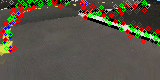

# Duckietown-Imagepipeline
Contains the imaging pipeline of a Line detector node in Duckietown-Lanefollowing model  from www.duckietown.org
## Input Image

## Color Segmentation

## Edge Detection

## Image with normals point and detected lines

The following gif should give a idea as to how the algorithm works.The heat map on the top is a representation of the  values corresponding to the estimates distance and angle with respect to the right lane center.Each line segment that is detected is used to get the estimate.The distance and angle that has the highest vote is considered for the estimation.

