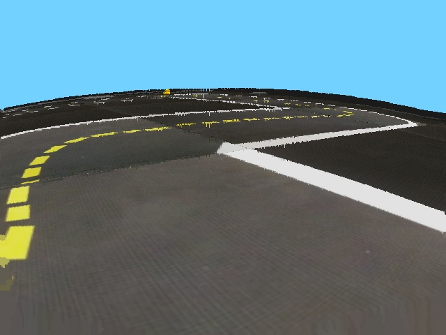

# Duckietown-Imagepipeline
Contains the imaging pipeline of a Line detector node in Duckietown-Lanefollowing model  from www.duckietown.org
## Input Image

## Color Segmentation

## Edge Detection

## Image with normals point and detected lines

